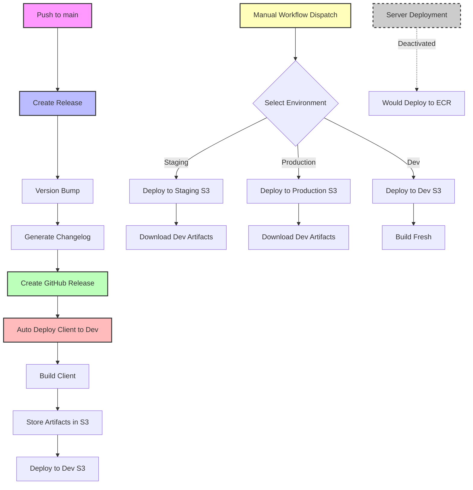

# Hub

Welcome to the Hub!

The codebase is organized as a monorepo using pnpm workspaces with the following structure:

```plain
hub/
├── apps/
│   ├── client/       # React frontend application for the TV and Mobile Hubs
│   └── server/       # Node.js backend application with shared code
├── packages/         # Shared utilities and configurations
│   ├── eslint-config/
│   ├── identity-client/
│   └── tsconfig/
```

## Getting Started 🚀

### Prerequisites

- Node.js 22+
- pnpm 10.6.5+

### Installation

```bash
pnpm install
```

#### Authentication Setup

If you encounter authentication issues with private packages (401 Unauthorized errors), you'll need to set up an NPM_TOKEN environment variable:

1. **Get your npm auth token** from your global `.npmrc` file:

   ```bash
   grep "_authToken" ~/.npmrc | cut -d'=' -f2
   ```

2. **Add the token to your shell profile** (replace `YOUR_TOKEN_HERE` with the actual token):

   ```bash
   echo 'export NPM_TOKEN="YOUR_TOKEN_HERE"' >> ~/.zshrc
   ```

3. **Reload your shell** or run:

   ```bash
   source ~/.zshrc
   ```

4. **Verify the setup**:

   ```bash
   npm whoami # Should show expected user
   ```

### Launching

- Set your client `.env` to the following:

```shell
VITE_STAGE="local"
```

- Activate the Volley VPN.
- Configure your browser allows videos to autoplay. ([Firefox](https://www.makeuseof.com/how-to-block-allow-autoplay-firefox/)) ([Chrome](https://support.flowics.com/en/articles/8870895-google-chrome-autoplay-policy))
- Run `pnpm dev` and access the client at <http://localhost:5173/>.
  - if you are getting stuck at the ident while running in browser, try reloading and clicking the screen to get around autoplay restrictions
  - when doing quick testing in local development, you may get an error related to Redis. This most likely means you either don't have Redis installed locally and/or need to start it. These command will help (if you utilize homebrew's CLI locally): `brew install redis` and `brew services start redis`. Then restart your dev environment via `pnpm dev`.

### Testing Subscription Flows

To test subscription flows in-browser locally, use the dev upsell mode:

```bash
# Access with dev upsell enabled
http://localhost:5173/?dev-upsell=true
```

This replaces real subscription calls with a testing modal that simulates different subscription outcomes (Success, Failed, Already Purchased). **Please note** this overrides your user subscription status -- you'll get immediate and game pre-roll upsell every time!

**Platform and Environment Support:** Dev upsell mode is only available on local web development. It is automatically disabled on FireTV devices and remote environments.

### Development Override Parameters

URL parameters are available for testing and development in non-production environments. See the [full dev overrides reference](./apps/client/docs/dev-overrides.md) for the complete list.

## Package Documentation 📚

For more detailed information about setting up the server and client packages, please refer to the respective readme files:

- [Client Documentation](./apps/client/README.md)
- [Server Documentation](./apps/server/README.md)

## Development Guidelines 🛠️

For detailed information about the codebase architecture, coding conventions, and best practices, see:

- [Developer Guidelines](./DEVELOPER.md)
- [App Initialization](./apps/client/docs/initialization.md)
- [CI/CD System](./docs/ci-cd.md) - Release flow, deployment, workflows, secrets, troubleshooting
- [List of Wise Decisions](./docs/list-of-wise-decisions.md) - Non-obvious design decisions and their rationale
- [Triggering Hub Tests from Other Repos](./TRIGGERING_HUB_TESTS.md) - Guide for teams that want to trigger Hub functional tests

### Development Log (Optional)

For developers who want to maintain context across development sessions:

1. **Create a personal dev log**: Add a `DEV_LOG.md` file in the project root
2. **Automatic updates**: Claude Code will automatically update this file when making significant changes
3. **Git ignored**: The file is already added to `.gitignore` so it stays local
4. **Contents**: Includes problem descriptions, technical solutions, files modified, and implementation details

This is especially useful for complex features or bug fixes where you want to preserve context and technical decisions for future reference.

## Available Scripts 🎮

From the root directory, you can run:

```shell
# Start development servers for all applications
pnpm dev

# Build all applications
pnpm build

# Run linting across all packages
pnpm lint

# Fix linting issues
pnpm lint:fix

# Run all tests (unit and functional)
pnpm test

# Run only unit tests
pnpm test:unit

# Run only functional tests
pnpm test:functional
```

## Working with Workspaces 🔄

This project uses pnpm workspaces, which allows you to:

1. **Run commands in specific packages:**

   ```bash
   # Format: pnpm --filter <package-name> <command>
   pnpm --filter @hub/client dev
   pnpm --filter @hub/server test
   ```

2. **Run commands in all packages:**

   ```bash
   # Run the same command in all packages that have that script
   pnpm -r lint
   ```

3. **Run commands in packages that have changed:**

   ```bash
   # Only run in packages affected by recent changes
   pnpm --filter "...[origin/main]" test
   ```

## Release and Deploy Workflow 🚀

The project uses semantic-release for automated versioning and deployment. Here's how it works:

### Release Process

1. **Trigger**: The release process is triggered on pushes to the `main` branch or manually via workflow dispatch.

2. **Version Bumping**:
   - Uses semantic-release to automatically determine the next version based on commit messages
   - Commit types (`feat`, `fix`, `breaking`, etc.) determine the version bump
   - Updates version in all `package.json` files

3. **Release Steps**:
   - Creates a new release commit with updated versions
   - Generates a changelog
   - Creates a GitHub release

### Deployment Process

#### Client Deployment

The client deployment supports both automatic and manual deployments:

- **Automatic Dev Deployment**: Every release is automatically deployed to the dev environment
- **Manual Staging/Production**: Staging and production require manual approval via GitHub Actions
- Builds the client application and stores versioned artifacts in S3
- Uses git tags to ensure correct version deployment
- Builds a config.js file to pass environment variables

**Manual Deployment Process:**

1. Go to Actions → Deploy Client → Run workflow
2. Select environment: `dev`, `staging`, or `production`
3. Enter version number (e.g., `1.2.3`)
4. For staging/production: Deployment will use pre-built artifacts from dev deployment

**Key Features:**

- **Artifact Reuse**: Staging and production use the exact same build artifacts as dev
- **Fail-Safe**: Will fail if trying to deploy to staging/production without corresponding dev artifacts
- **Version Control**: Only deploys tagged releases, ensuring consistency

#### Server Deployment

> ⚠️ **Note**: Server deployment is currently **deactivated** in the release workflow.

- Builds a Docker image with the server application
- Uses AWS ECR (Elastic Container Registry) for container management
- When active, would follow the same manual approval process for staging/production
- Image tagging strategy:
  - Development: `main-{short-sha}-{timestamp}` (e.g., `main-a1b2c3d-20240315123456`)
  - Staging: `staging-{timestamp}` tag
  - Production: (to be implemented)
- Deployment workflow (when active):
  1. Every release would be automatically deployed to dev ECR
  2. Non-beta releases would be promoted to staging ECR
  3. Images are pushed to ECR registry: `375633680607.dkr.ecr.us-east-1.amazonaws.com/hub`
- The deployment process includes:
  - Automatic version bumping
  - Docker image building with proper labels
  - ECR authentication and image pushing
  - Environment-specific promotions
For instance:
  - Flux knows to pick up the tags of given formats [in the kubernetes project](https://github.com/Volley-Inc/kubernetes/pull/602/files)
  - Releases get tagged with given timestamps as they are build and uploaded [in this GH workflow](https://github.com/Volley-Inc/hub/blob/main/.github/workflows/deploy-server.yml)
  - K8s picks them up [in volley-infra-tenants](https://github.com/Volley-Inc/volley-infra-tenants/pull/2991/files)

### Environment Promotion

1. **Development**:
   - **Automatic**: Every release is automatically deployed to dev
   - **Manual**: Can also be manually triggered for testing branches

2. **Staging**:
   - **Manual Only**: Requires manual workflow dispatch
   - Uses pre-built artifacts from dev deployment
   - Version parameter is required

3. **Production**:
   - **Manual Only**: Requires manual workflow dispatch
   - Uses pre-built artifacts from dev deployment
   - Version parameter is required

### Updating client env variables

Our client env variables are being passed in through a non-bundled js file named config.js that should be served directly next to our client's index.html. This file is built by a github action and has a unique pattern. These are the files to update to add/remove/update env vars:

- apps/client/scripts/build-env-config.js -- add to config object
- .github/actions/create-environment-config/action.yml -- add to list of env variables and define as an input at the top of the action declaration
- .github/workflows/deploy-client.yml -- add the different env values for each of the different env deployment jobs
- apps/client/src/config/envconfig.ts -- create a getter function to safely import and export the window variable
- apps/client/src/types/globals.d.ts -- define the new global key/value for typescript to know about it

example PR: <https://github.com/Volley-Inc/hub/pull/96> (note: this PR was missing a necessary change to add input definitions for the GH action included here <https://github.com/Volley-Inc/hub/pull/98>)

### Workflow Diagram



## Deployment

### Deployed URLs

You can reach the currently deployed dev / staging / production at:

- <https://game-clients-dev.volley.tv/hub/>
- <https://game-clients-staging.volley.tv/hub/>
- <https://game-clients.volley.tv/hub/>

### How to deploy

Deployment to Dev:

- Deployments to dev happens automatically when you merge to main
- Uses semantic/conventional commit styles (feat, fix) for versioning (minor, patch)
- Breaking changes use "feat!" for major version bumps

Deployment to Staging / Production:

- Go to Actions tab in the repo
- Select "Deploy Client"
- Choose "Run workflow"
- Select Use workflow from Branch: main and input the version you want to deploy
- Select the environment you want to deploy to
- Run the workflow

Monitoring Deployments:

- Monitor the release channel in slack `#hub-releases` - it will show status of successful or failed deployments with auto-generated descriptions and change logs
- Keep an eye on DataDog and Amplitude charts with key performance metrics
  - <https://app.datadoghq.com/dashboard/v3a-42k-hmz/hub-test-dash?fromUser=false&refresh_mode=sliding&tpl_var_env%5B0%5D=staging&from_ts=1752512154870&to_ts=1752515754870&live=true>
  - <https://app.amplitude.com/analytics/volley/dashboard/fco3u8r7>
- You can check the deployed dev/staging URL debug menus to see current version
  - If a deployment is causing issues that require you to roll back, simply deploy the rolled back version manually via the Github action from dev -> staging -> prod

Brief vid walkthrough of deployment: <https://drive.google.com/file/d/1eLrffUNHgC6_J5jd6cBHeciRZTQNlL42/view?usp=sharing>

## Platforms

In the modern day and age, having the Hub on a single platform just can't pay the bills. This Hub repo aims to deliver the Hub experience the users across a variety of platforms such as FireTV, Samsung, and LG. There are some differences in the development workflow to test the Hub across these different platforms that one must be aware of.

### FireTV

Prerequisite: make sure you have android platform tools set up ([documentation](https://github.com/Volley-Inc/platform/tree/main/shells/firetv-shell#install-android-platform-tools)), and that your Fire TV Stick is in dev mode ([documentation](https://github.com/Volley-Inc/platform/tree/main/shells/firetv-shell#prepare-your-fire-tv-stick)).

The device IP is found at `Settings → My Fire TV → About → Network`; `adb connect <ip>` to connect to the device.

Update or install the apk on the device; following the instructions [in the firetv-shell project](https://github.com/Volley-Inc/platform/tree/main/shells/firetv-shell#apk-installation), install the appropriate firetv-shell version. If you need to remove the old version of the apk, `adb uninstall com.volleygames.phoenix` first.

Create an http `ngrok` tunnel pointed at port 5173 (client port).

Make sure the ngrok url is [configured](https://github.com/Volley-Inc/platform/tree/main/shells/firetv-shell#update-vite-config) in the vite `allowedHosts`, then launch the application in dev mode using the ngrok url as the `dev_url`:

```
adb shell am start -n com.volleygames.phoenix/com.volley.app.MainActivity \
    -e dev_url "https://${ngrok_url}?volley_platform=FIRE_TV"
```

If you need to kill the process on the device, `adb shell am force-stop com.volleygames.phoenix`

### Samsung

 If you have not previously set up a Samsung TV / account, first follow these instructions to do so: <https://github.com/Volley-Inc/platform/blob/main/shells/samsung-shell/docs/DEVELOPMENT.md>

If you have already gotten the Hub running on Samsung before, subsequent efforts to do so should be a fair bit quicker. To launch dev / staging / production Hub on your device:

- Navigate to locally cloned Platform Repo (<https://github.com/Volley-Inc/platform/tree/main>),
- from root:  `git pull origin main`
- `cd` to `platform/shells/samsung-shell`
- from samsung-shell root: `pnpm install`
- on Samsung TV, click back to exit out of the Romance Hub channel you had been watching. Navigate to settings -> All settings ->  Connection -> Network -> Network Status -> IP Settings -- from here you should be able to see IP Address for device
- (make sure you and your device are connected to same WIFI and your VPN is on)
- connect to that ip address using `sdb connect <ip-address>`
- execute the deploy command of your preference in the terminal:

```
scripts/tizen-deploy.sh -c <your-profile-name>

# Deploy with specific build mode (production, staging, development, local-only)
scripts/tizen-deploy.sh --mode production
```

To launch a locally running version of the Hub on your device, you will need to perform a few additional steps:

- Navigate to the root of the hub, `pnpm install`
- In another terminal tab, `ngrok http 5173`
- In the Hub update `apps/client/vite.config.ts` to allow your ngrokd url]

```
server: {
   allowedHosts: ["f032b18e497d.ngrok.app"],
},
```

- In the Samsung shell `.env.local`, update the Vite redirect URL value: `VITE_REDIRECT_URL=https://f032b18e497d.ngrok.app`
- Execute the deploy command for a local build in your terminal: `scripts/tizen-deploy.sh -c <your-profile-name>` . You should now be able to see your locally running Hub on your very own Samsung telly!

### LG

 If you have not previously set up a LG TV / account, first follow these instructions to do so: <https://www.notion.so/volley/LG-Development-Setup-245442bc971380589ef3f324ffa834d8#245442bc971380589ef3f324ffa834d8>

If you have already done the LG account and device setup, launching the Hub takes a few less steps.

- Check IP of device using developer mode app
- run `ares-setup-device` and modify existing device with IP
- confirm connection with `ares-device --system-info --device <tv_device_name>`
- (make sure you are on Node V20)
- run `pnpm build`
- as noted in Samsung docs above, if you are locally running the Hub, you will need to update the Hub's vite config with the ngrok'd Hub url
- depending on the environment you want to load, run the appropriate deploy command

      ```
      pnpm run deploy:dev
      pnpm run deploy:staging
      pnpm run deploy:prod
      ```

- badda bing badda boom now you hubbin' it up LG-style :hubsmile:
