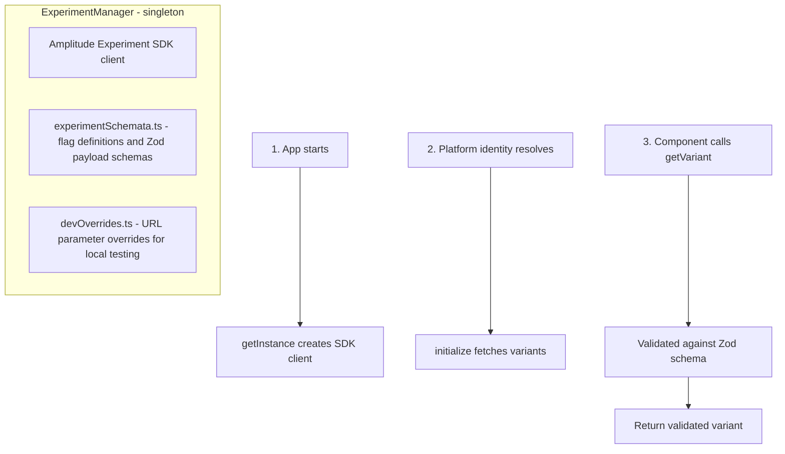

# Experiment System

Hub uses [Amplitude Experiment](https://www.docs.developers.amplitude.com/experiment/) for feature flags and A/B testing. Experiment variants are fetched at app initialization and validated at read time using Zod schemas.

## Architecture



### Why Zod validation?

Amplitude experiment payloads are arbitrary JSON. Without validation, a misconfigured experiment in the Amplitude dashboard could crash the client. Zod schemas in `experimentSchemata.ts` enforce the expected shape at runtime, falling back gracefully if validation fails.

## Files

| File | Purpose |
|------|---------|
| `ExperimentManager.ts` | Singleton manager — initialization, variant retrieval, URL overrides |
| `experimentSchemata.ts` | `ExperimentFlag` enum, Zod schemas for each flag's payload, type mappings |

## Adding a New Experiment

1. **Create the flag in Amplitude** — Define the experiment in the Amplitude Experiment dashboard with the desired variants
2. **Add the flag to `ExperimentFlag` enum** in `experimentSchemata.ts`:
   ```typescript
   export enum ExperimentFlag {
     // ...existing flags
     MyNewFlag = "my-new-flag",  // must match the Amplitude flag key
   }
   ```
3. **Define the payload schema** (if the flag has a structured payload):
   ```typescript
   export const MyNewFlagSchema = z.object({
     someField: z.string(),
     someNumber: z.number().optional(),
   })
   ```
4. **Register the schema** in `PAYLOAD_SCHEMAS`:
   ```typescript
   export const PAYLOAD_SCHEMAS = {
     // ...existing schemas
     [ExperimentFlag.MyNewFlag]: MyNewFlagSchema,
   }
   ```
   For boolean-only flags (no payload), add to `BOOLEAN_VALUE_FLAGS` instead.
   For flags where the payload is optional, add to `OPTIONAL_PAYLOAD_FLAGS`.
5. **Use in code**:
   ```typescript
   const variant = getExperimentManager().getVariant(ExperimentFlag.MyNewFlag)
   if (variant?.value === "treatment") {
     // treatment behavior
   }
   ```

## Cleaning Up a Concluded Experiment

1. Remove the flag from `ExperimentFlag` enum
2. Remove its schema from `PAYLOAD_SCHEMAS` (and from `BOOLEAN_VALUE_FLAGS` / `OPTIONAL_PAYLOAD_FLAGS` if applicable)
3. Remove all code paths that check `getVariant()` for that flag — collapse to the winning variant's behavior
4. Remove associated tests
5. Archive or disable the experiment in Amplitude dashboard

## URL Parameter Overrides

For local testing, experiment variants can be overridden via URL parameters without touching Amplitude. Overrides are read from `devOverrides.ts` which parses `EXPERIMENT_VARIANT_OVERRIDES` from the URL.

Example: `http://localhost:5173/hub/?reorder-mp-tiles:treatment`

This sets the `reorder-mp-tiles` flag to `"treatment"` regardless of what Amplitude returns. Payload overrides can be passed as JSON strings.

## Identity

Experiments are targeted using a combination of:

- **`anonymousId`** (device ID) — available pre-auth, used for device-level targeting
- **`accountId`** (user ID) — available post-auth, used for user-level targeting
- **`platform`** — injected as a user property (firetv, lg, samsung, mobile, web)
- **User properties** — subscription status, device info, etc.

`createExperimentIdentity()` returns `null` if neither ID is available, signaling that initialization should be deferred.

## Current Flags

See `ExperimentFlag` enum in `experimentSchemata.ts` for the current list. As of this writing:

- `ReorderMpTiles` — Controls game tile ordering on the carousel
- `SuppressImmediateUpsell` — Boolean flag to suppress the immediate upsell modal
- `Jeopardy/SongQuiz/CoComelon/WheelOfFortunePayloadSwap` — Per-game asset and metadata overrides
- `JeopardyReloadThreshold` — Controls the WebAssembly OOM prevention reload threshold
- `QrModalConfig` — Customizes the QR code upsell modal (video, copy, sizing)
- `WeekendRebrand` / `WeekendRebrandInformationalModal` — Weekend.com rebranding experiments
