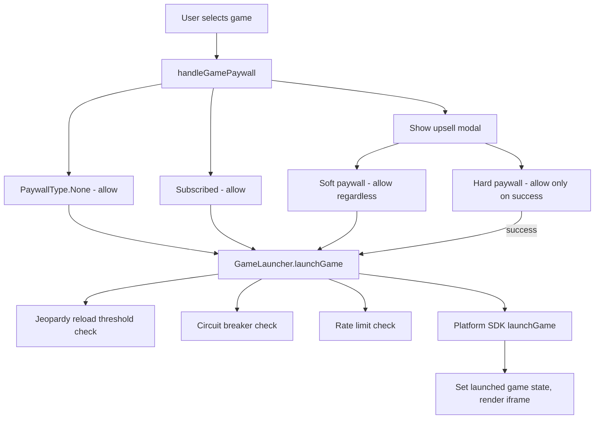
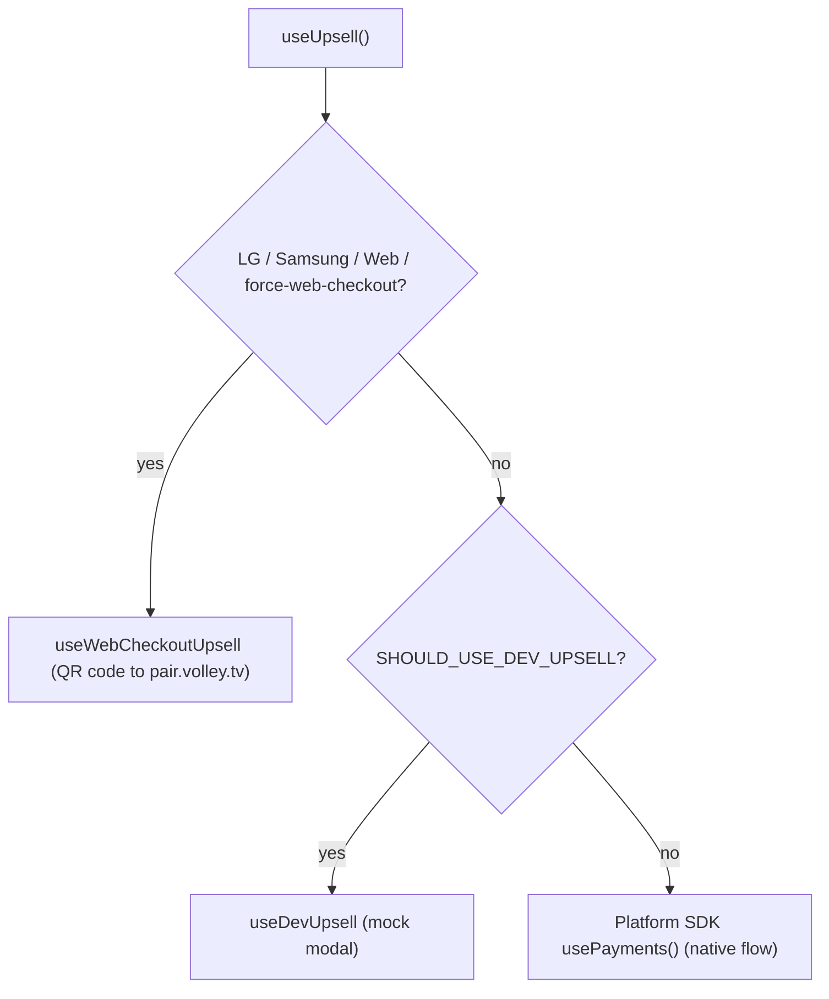
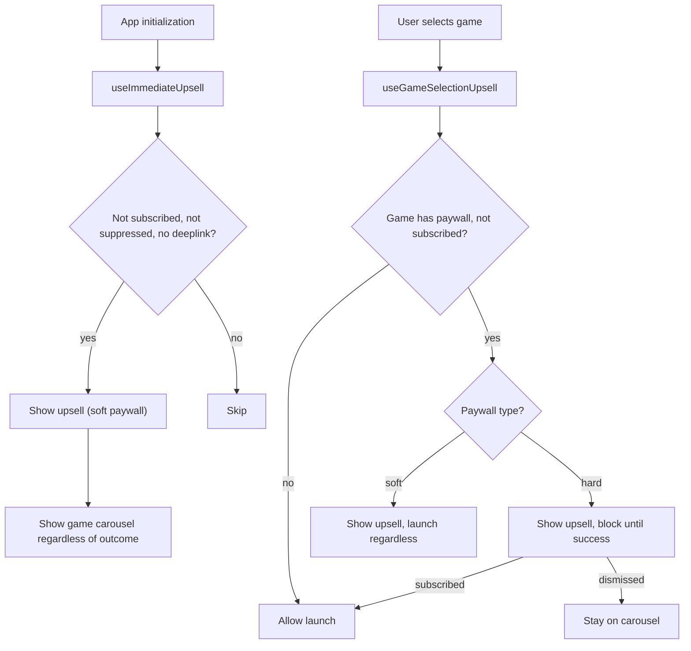

# Game Lifecycle

How games get selected, launched, and monetized.

## Game Selection & Launch

| Hook | Purpose |
|------|---------|
| `useGames` | Builds the ordered game list from experiments, platform rules, and asset validation |
| `useGameLauncher` | `GameLauncher` class — orchestrates launches with rate limiting, circuit breaker, and Jeopardy reload |
| `useIsJeopardyReload` | Detects whether the current page load is a Jeopardy OOM-prevention reload |
| `useGameFocusHandler` | Manages focus behavior when a game tile is selected |
| `useLaunchedGameState` | State management for the currently launched game (URL, vitals, cleanup) |

### Game Launch Flow

## Upsell & Subscription

The upsell system has multiple hooks that compose together. `useUpsell` is the unified entry point; the others are providers/implementations.

| Hook | Purpose |
|------|---------|
| `useUpsell` | Unified `subscribe()` interface — selects the right provider based on platform |
| `useImmediateUpsell` | Pre-roll upsell shown immediately after app init for unsubscribed users |
| `useGameSelectionUpsell` | Paywall enforcement when selecting a game |
| `useWebCheckoutUpsell` | Web checkout implementation — QR modal, sessionStorage payment sync |
| `useDevUpsell` | Dev-only mock upsell modal for testing |
| `useIsSubscribed` | Checks subscription status from Platform SDK |

### Upsell Provider Selection

### Upsell Timing

