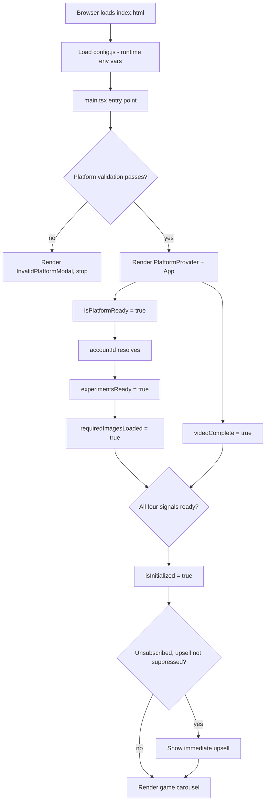

# App Initialization

How the Hub client boots from a blank page to a rendered carousel.

## Overview

## Entry Point

`main.tsx` runs several things before React renders:

| Step | What | Why |
|------|------|-----|
| `import "./polyfills"` | Polyfill imports | Browser compatibility |
| `import "./utils/datadog"` | Datadog RUM and logs init | Observability from first paint |
| `init({ throttleKeypresses: true, throttle: 50 })` | Norigin spatial navigation | Must happen before any focusable component mounts |
| `initResourceDetection([pngDetector, s3Detector])` | PNG and S3 asset format detection | Determines whether to use PNG or AVIF/WebP assets |
| Arrow key `preventDefault` listener | Blocks default browser scrolling on arrow keys | TV remotes send arrow key events that would scroll the page |
| Platform validation gate | `isStatedTV() && !agentIsTV()` check | If the Platform SDK says it's a TV but the user agent disagrees, show an error modal instead of the app |

After validation passes, the app renders inside `PlatformProvider` (configures Platform SDK with `gameId: "hub"`, stage, API URLs, Segment key, 30s ready timeout) wrapping `ArrowPressProvider` wrapping `App`.

## Initialization Signals

`isInitialized` is a conjunction of four signals. On mobile, it is always `true` (no loading screen).

| Signal | Owner | Depends on | Description |
|--------|-------|------------|-------------|
| `isPlatformReady` | `usePlatformReadiness` | Platform SDK `isReady` | Platform SDK has finished initializing and is ready for API calls |
| `experimentsReady` | `AppBody` state | `isPlatformReady`, `accountId` or `anonymousId` | Amplitude experiments have been fetched and are available via `getVariant()` |
| `videoComplete` | `AppBody` state | Ident video playback | The ident/logo video has finished playing. Set immediately on Jeopardy reload |
| `requiredImagesLoaded` | `useImagePreloading` | `experimentsReady` | All loading-blocking images have been preloaded |

The `isInitialized` memo in `AppBody` latches once all four are true (via `hasInitializedRef`), so it never flips back to false after initialization.

## Asset Loading Tiers

`useImagePreloading` manages two tiers of image loading:

**Required (loading-blocking)** — must complete before `isInitialized`:

| Asset | Condition |
|-------|-----------|
| First hero image | Unless `deferMainHubAssets` |
| Tile images | Unless `deferMainHubAssets` |
| Focus indicator | Unless `deferMainHubAssets` |
| Status banners | Unless `deferMainHubAssets` |
| Web checkout images | Only if unsubscribed on a web checkout platform |

**Optional (non-blocking)** — loaded after required assets complete:

| Asset | Condition |
|-------|-----------|
| Remaining hero images | Always optional, or all heroes if `deferMainHubAssets` |
| Main hub assets | If `deferMainHubAssets` is true |
| Tile animations | Always optional |

## Error Handling

`useInitializationError` evaluates error conditions in priority order and returns the first match:

| Error Type | Trigger | Condition |
|------------|---------|-----------|
| `TEST_ERROR` | `dev_override` | `force-platform-error` dev override is active |
| `DEVICE_AUTH_ERROR` | `device_auth_error` | `PlatformProvider` passed a `platformInitializationError` string |
| `PLATFORM_ERROR` | `platform_error` | `platformStatus.error` is set on the Platform SDK |
| `ANONYMOUS_ID_ERROR` | `experiment_identity_error` | Platform is ready but no `anonymousId` available (non-mobile only) |

When an error is returned, `useFailedInitializationModal` logs it to Datadog, displays an error modal, and provides an exit handler that calls `exitApp()`.

## Platform-Specific Behavior

| Platform | Behavior |
|----------|----------|
| Mobile | `isInitialized` is always `true` — no loading screen, no video gate |
| Jeopardy reload | `videoComplete` set immediately via `useIsJeopardyReload` — skips ident to avoid OOM from re-playing WebAssembly-heavy video |
| LG / Samsung / Web | `shouldUseWebCheckout()` returns true — web checkout images added to the required loading tier |

## Observability

`useInitializationDatadogRUMEvents` tracks initialization performance via Datadog RUM duration vitals and per-stage action events.

### Duration Vitals

| Vital | Start | End |
|-------|-------|-----|
| `app_initialization` | App start | `isInitialized = true` |
| `core_ux_availability` | App start | QR code rendered (web checkout unsubscribed) or carousel ready (everyone else) |
| `asset_loading` | App start | `isInitialized` and `optionalImagesLoaded` |

### Per-Stage Action Events

Each initialization signal emits a Datadog action when it first becomes true:

| Stage | Action Name |
|-------|-------------|
| `videoComplete` | `app_initialization_video_complete` |
| `experimentsReady` | `app_initialization_experiments_ready` |
| `requiredImagesLoaded` | `app_initialization_images_loaded` |
| `platformReady` | `app_initialization_platform_ready` |
| `isInitialized` | `app_initialization_fully_complete` |
| `tileImagesLoaded` | `asset_loading_tile_images_loaded` |
| `firstHeroImageLoaded` | `app_initialization_asset_loading_first_hero_image` |
| `remainingHeroImagesLoaded` | `app_initialization_asset_loading_remaining_hero_images` |
| `focusIndicatorLoaded` | `app_initialization_asset_loading_focus_indicator` |
| `webCheckoutRequiredImagesLoaded` | `app_initialization_asset_loading_web_checkout_required` |
| `statusBannersLoaded` | `app_initialization_asset_loading_status_banners` |
| `tileAnimationsLoaded` | `app_initialization_asset_loading_tile_animations` |
