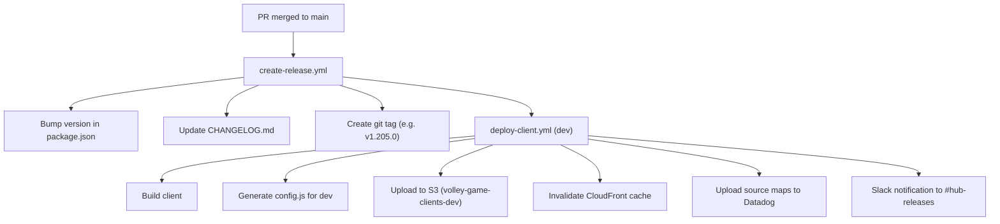

# CI/CD System

This document covers the full CI/CD pipeline for the Hub monorepo: how code gets merged, released, deployed, and tested in production.

## Release Flow

Dev deployments are fully automatic on merge. Staging and production are manual.

### Deploying to Staging

1. Go to **Actions → Deploy Client** in GitHub
2. Click **Run workflow**
3. Select `main` branch
4. Set **environment** to `staging`
5. Enter the **version tag** to deploy (e.g. `1.205.0`)
6. The workflow reuses the dev build artifact — it does not rebuild
7. After deploy, `staging-functional-tests.yml` and `staging-agentic-tests.yml` are triggered automatically via `repository_dispatch`
8. Linear tickets matching the deployed commits are moved to "Staging" state

### Deploying to Production

Same as staging, but select `production` as the environment. Linear tickets are moved to "Production" state.

### Rollback

To rollback, deploy a previous version tag to the target environment. The artifact reuse strategy means any previously deployed version can be redeployed without rebuilding.

## Workflows

### PR Validation

| Workflow | Trigger | Purpose |
|----------|---------|---------|
| `lint-build-test.yml` | PR, merge group | Runs lint, typecheck, build, and unit tests |
| `validate-commit-message.yml` | PR opened/edited/synced, merge group | Validates PR title follows conventional commit format |
| `playwright-functional.yml` | PR to main, merge group | Runs functional Playwright tests against a local preview server |
| `playwright-agentic.yml` | PR to main (path-filtered to `src/**`, `test/agentic/**`) | Runs AI-powered agentic tests against a local preview server |

### Release & Deploy

| Workflow | Trigger | Purpose |
|----------|---------|---------|
| `create-release.yml` | Push to main, manual dispatch | Runs semantic-release, creates version tag, auto-deploys to dev |
| `deploy-client.yml` | Called by create-release, manual dispatch | Builds and deploys client to dev/staging/production via S3 + CloudFront |
| `deploy-server.yml` | Called by other workflows (never activated) | Builds Docker image and pushes to ECR. **Never used** — Hub was originally scaffolded like other VGF apps with independent server deployment, but game launch moved to the platform layer and Hub server deployment was descoped. |

### Post-Deploy Testing

| Workflow | Trigger | Purpose |
|----------|---------|---------|
| `staging-functional-tests.yml` | Manual dispatch, `repository_dispatch` (hub-client-release-staging) | Runs functional tests against staging. Uses dynamic sharding. |
| `staging-agentic-tests.yml` | Manual dispatch, `repository_dispatch` (hub-client-release-staging) | Runs agentic tests against staging. Fixed 3-shard matrix. |

Staging deploys do not trigger these test workflows directly. Instead, the staging job in `deploy-client.yml` triggers the **`workflow-dispatch-orchestrator`** (`Volley-Inc/workflow-dispatch-orchestrator`), which coordinates the test runs:

1. Staging deploy completes in `deploy-client.yml`
2. Deploy job generates a GitHub App token (via `VOLLEY_WORKFLOW_TRIGGER_APP_ID` / `VOLLEY_WORKFLOW_TRIGGER_PRIVATE_KEY`) scoped to the orchestrator repo
3. Deploy job triggers `orchestrate.yml` with `service=hub`, the deployed `version`, and `wait=true`
4. The orchestrator dispatches `repository_dispatch` events (type `hub-client-release-staging`) back to the Hub repo, which trigger the test workflows above
5. The deploy job polls the orchestrator run, waits for completion, and parses pass/fail results from the orchestrator's logs
6. If any tests fail, the deploy job itself fails — so a staging deploy with test failures shows as red in the Actions tab

This indirection exists so that other repos can also trigger Hub tests on their own deploys (e.g., platform changes that might affect Hub). See [`TRIGGERING_HUB_TESTS.md`](../TRIGGERING_HUB_TESTS.md) for how external repos use this.

## Custom Actions

### `setup-environment`

Sets up Node.js 22, pnpm, configures npm registry auth via `NPM_TOKEN`, and installs dependencies with caching. Used by nearly all workflows.

### `create-environment-config`

Generates the runtime `config.js` file that gets deployed alongside the built client. This file is **not bundled** — it's generated per-environment at deploy time so the same build artifact works across dev/staging/production. Injects:
- `BACKEND_SERVER_ENDPOINT`
- `AMPLITUDE_EXPERIMENT_KEY`
- `SEGMENT_WRITE_KEY`
- `DATADOG_APPLICATION_ID` / `DATADOG_CLIENT_TOKEN`
- `VOLLEY_LOGO_DISPLAY_MILLIS`
- `environment` and `version`

### `client-release-outcome-slack-notification`

Sends deployment status notifications to `#hub-releases` in Slack. Includes:
- Version number and environment
- AI-generated changelog summary (via OpenAI)
- Link to the GitHub release
- Occasional horse facts

## Secrets Inventory

| Secret | Used By | Purpose |
|--------|---------|---------|
| `NPM_TOKEN` | All workflows | Authenticates with npm registry for private `@volley/*` packages |
| `SSH_DEPLOY_KEY` | `create-release.yml` | Allows semantic-release to push version commits back to main |
| `TV_GAMES_CI_AWS_ACCESS_KEY_ID` | `deploy-client.yml` | AWS credentials for S3 upload and CloudFront invalidation |
| `TV_GAMES_CI_AWS_SECRET_ACCESS_KEY` | `deploy-client.yml` | AWS credentials (secret key) |
| `SLACK_BOT_TOKEN` | `deploy-client.yml` | Posts deployment notifications to Slack |
| `OPENAI_API_KEY` | deploy, agentic tests, AI review | Generates changelog summaries, powers agentic tests, AI code review |
| `DATADOG_API_KEY` | `deploy-client.yml` | Uploads source maps to Datadog for error tracking |
| `LINEAR_API_KEY` | `deploy-client.yml` | Moves Linear tickets between states on deploy (Merged → Staging → Production) |
| `STAGING_HUB_URL` | staging test workflows | Base URL for staging functional/agentic tests |
| `VOLLEY_WORKFLOW_TRIGGER_APP_ID` | `deploy-client.yml` | GitHub App credentials for triggering cross-repo workflows |
| `VOLLEY_WORKFLOW_TRIGGER_PRIVATE_KEY` | `deploy-client.yml` | GitHub App private key for workflow triggers |
| `AWS_ACCESS_KEY` | `deploy-server.yml` (deactivated) | AWS credentials for ECR push |
| `AWS_SECRET_ACCESS_KEY` | `deploy-server.yml` (deactivated) | AWS credentials for ECR push |

All secrets are sourced from either repository secrets or organization secrets (no personal accounts).

## Deployment Targets

| Environment | URL | S3 Bucket | Auto-deploy? |
|-------------|-----|-----------|-------------|
| Dev | `https://game-clients-dev.volley.tv/hub/` | `volley-game-clients-dev` | Yes, on merge to main |
| Staging | `https://game-clients-staging.volley.tv/hub/` | `volley-game-clients-staging` | No, manual dispatch |
| Production | `https://game-clients.volley.tv/hub/` | `volley-game-clients-production` | No, manual dispatch |

## Artifact Reuse Strategy

The client is built once during the dev deployment. For staging and production, the **same build artifact** is reused — only the `config.js` file changes per environment. This ensures what you test in staging is byte-for-byte identical to what ships to production (minus configuration).

## Troubleshooting

### Semantic-release didn't create a new version

- Check that the merged commits follow conventional commit format (`feat:`, `fix:`, etc.)
- Commits with types `docs`, `style`, `refactor`, `test`, `chore`, `ci`, `build` do **not** trigger a release
- Check the `create-release.yml` run logs for semantic-release output

### Deploy failed during S3 upload

- Verify AWS credentials (`TV_GAMES_CI_AWS_ACCESS_KEY_ID` / `TV_GAMES_CI_AWS_SECRET_ACCESS_KEY`) are still valid
- Check if the S3 bucket exists and the IAM role has write permissions
- Check the deploy workflow logs for the specific AWS CLI error

### CloudFront cache is stale after deploy

- The deploy workflow runs `aws cloudfront create-invalidation` automatically
- Invalidations can take 5-15 minutes to propagate globally
- If still stale, manually invalidate via AWS console: CloudFront → Distribution → Invalidations → Create with path `/*`

### Staging tests failed after deploy

- Check if the staging URL is accessible
- Verify `STAGING_HUB_URL` secret matches the actual staging URL
- Review Playwright test artifacts (screenshots, traces) uploaded as GitHub Actions artifacts

### Source maps not showing in Datadog

- Check the `upload:sourcemaps` step in the deploy workflow
- Verify `DATADOG_API_KEY` is valid
- Confirm the `--release-version` matches the deployed version
- Source maps are uploaded with service name `hub-client`

## Past Incidents (RCAs)

Hub-specific incidents worth knowing about, with links to full Notion RCAs:

### Amplitude experiment misconfiguration hiding game tiles (Nov 2025)

An incorrectly configured Amplitude experiment made CoComelon inaccessible on LG/Samsung and Jeopardy inaccessible on LG for 1.5 hours, affecting 134 users. Fixed via Amplitude config changes. Led to locking down Amplitude experiment access and formalizing protocols for experiment changes.

[Full RCA](https://www.notion.so/volley/CCM-on-LG-and-Samsung-and-J-on-LG-inaccessible-in-Hub-carousel-2bc442bc9713804f8963fd0830bd6699)

### Amplitude userId targeting disabled by code change (Nov 2025)

A code change disabled account-level experiment targeting, preventing Samsung testers from seeing a CCM tile that was targeted to their account. Reverted quickly, but disrupted an external partner's testing session.

[Full RCA](https://www.notion.so/volley/Amplitude-userId-Targeting-Unavailable-2c5442bc971380ffac79eb2ca676578e)

### Game launch spike causing Jeopardy backend failures (Oct 2025)

A client-side bug caused repeated Jeopardy launch requests from a single account (~98% of traffic). Lack of per-user rate limiting on Platform API let the requests through, causing memory leak errors on the Jeopardy Fire backend. SEV-2 incident, 5 hours to resolution. This incident led to the circuit breaker and rate limiter in `GameLauncher`.

[Full RCA](https://www.notion.so/volley/RCA-110-Game-Launch-Spikes-J-Failures-28c442bc9713807da6a9e62eca81dff7)